# Implementation Plan: GeoSalud — Derivaciones a CAPS (Prototipo estático)

> Convert the feature design into a series of prompts for a code-generation LLM that will implement each step with incremental progress. Make sure that each prompt builds on the previous prompts, and ends with wiring things together. There should be no hanging or orphaned code that isn't integrated into a previous step. Focus ONLY on tasks that involve writing, modifying, or testing code.

## Overview

Plan incremental para construir el prototipo GeoSalud como una página HTML auto-contenida (Static_Bundle) servida estática, sin AWS, sin base de datos y sin IaC. El runtime es 100 % navegador (JavaScript ES2020+ con JSDoc, módulos ES, Leaflet 1.9.x). El dataset REFES se obtiene una vez offline mediante un script Python que invoca al MCP local `mcp-datos-abiertos-arg`, lo normaliza con la API Georef y lo materializa como `prototype/data/refes.json`.

Las tareas avanzan desde el dominio puro (módulos JS testeables sin DOM) hacia los componentes UI (Leaflet + tabs), intercalando tests (Vitest + fast-check, mínimo 100 runs por property test) junto a la implementación que validan. Cada test referencia las Properties P1–P21 del design. Las tareas de QA UI se intercalan con las tareas de UI, no como bloque al final.

**Lenguajes elegidos** (ya determinados durante Clarify y confirmados en el design):
- Cliente: JavaScript ES2020+ con anotaciones JSDoc, módulos ES nativos.
- Script offline: Python 3.12 (`pytest`, `pytest-asyncio`, `respx`, `httpx`, `ruff`, `black`).
- Tooling JS: Vitest + fast-check + ESLint + Prettier.

## Tasks

- [ ] 1. Configuración inicial del proyecto y tooling
  - [x] 1.1 Crear estructura de carpetas y archivos base
    - Crear `prototype/`, `prototype/modules/`, `prototype/ui/`, `prototype/data/`, `prototype/vendor/` (placeholder)
    - Crear `scripts/`, `tests/js/`, `tests/js/helpers/`, `tests/python/`
    - Crear `.gitignore` con entradas para Node (`node_modules/`, `coverage/`, `.vite/`), Python (`__pycache__/`, `.pytest_cache/`, `.venv/`), IDE (`.vscode/`, `.idea/`) y caché local (`.cache/`)
    - _Requirements: 1.1, 1.5_

  - [-] 1.2 Configurar `package.json` con scripts y dependencias dev
    - Declarar `"type": "module"` para módulos ES nativos
    - Dev deps: `vitest`, `@vitest/coverage-v8`, `fast-check`, `jsdom`, `@testing-library/dom`, `eslint`, `@eslint/js`, `prettier`
    - Scripts: `"test": "vitest --run"`, `"test:watch": "vitest"`, `"coverage": "vitest --run --coverage"`, `"lint": "eslint prototype tests/js"`, `"format": "prettier --write prototype tests/js"`, `"serve": "npx --yes serve prototype"`
    - _Requirements: 1.5_

  - [-] 1.3 Configurar ESLint y Prettier
    - `eslint.config.js` con `@eslint/js recommended`, parser ES2022, `sourceType: "module"`, reglas: `no-var`, `prefer-const`, `eqeqeq`, `no-magic-numbers` (warn) en `prototype/modules/**` y `prototype/ui/**`
    - `.prettierrc` con `singleQuote: false`, `printWidth: 100`, `trailingComma: "all"`
    - `.eslintignore` y `.prettierignore` con `prototype/vendor/**`, `prototype/data/**`, `coverage/**`
    - _Requirements: 1.5_

  - [-] 1.4 Configurar tooling Python (`pyproject.toml`)
    - Declarar Python 3.12, dependencias runtime (`httpx`, `pydantic`) y dev (`pytest`, `pytest-asyncio`, `respx`, `pytest-mock`, `ruff`, `black`)
    - Configurar `ruff` (line length 100, target `py312`) y `black` (line length 100)
    - Crear `tests/python/__init__.py` y `tests/python/conftest.py` mínimos
    - _Requirements: 1.5_

  - [~] 1.5 Configurar Vitest
    - `vitest.config.js` con `environment: "jsdom"`, `globals: false`, `coverage.include: ["prototype/modules/**", "prototype/ui/**"]`, `coverage.thresholds.lines: 70`
    - `tests/js/setup.js` que stubea `window.fetch` y resetea `localStorage` entre tests
    - _Requirements: 1.5_

  - [-] 1.6 Crear README inicial del prototipo
    - Secciones: descripción, estructura del Static_Bundle, comandos para servir estático (`npm run serve`, `python -m http.server -d prototype 8080`), procedimiento para regenerar `refes.json`, lista de variables de App_Config, comandos para tests JS (`npm test`) y Python (`pytest tests/python`)
    - _Requirements: 1.5, 2.6, 10.2_

- [ ] 2. Datasets estáticos seed (semilla mínima reproducible)
  - [-] 2.1 Crear `prototype/data/population_mock.json` con dataset INDEC mock
    - Estructura `{ meta: { schema_version: 1, source: "INDEC mock" }, units: [...] }`
    - Mínimo 5 unidades de ejemplo (`unit_id`, `unit_kind`, `name`, `population`) cubriendo `province`, `department`, `municipality` y `locality`
    - _Requirements: 4.1_

  - [-] 2.2 Crear `prototype/data/pathology_catalog.json`
    - Estructura `{ meta: { schema_version: 1 }, items: [...] }`
    - Catálogo inicial con códigos `RESP_AGUDA`, `CONTROL_NIÑO_SANO`, `VACUNACION`, `CLINICA_GENERAL` y sus `required_services`
    - _Requirements: 6.5, 6.9_

  - [-] 2.3 Crear `prototype/data/capacity_mock.json`
    - Estructura `{ meta: { schema_version: 1 }, items: [...] }`
    - Schema por item: `caps_id, availability ∈ {high|medium|low|unknown}, waiting_time_minutes, supplies_status, captured_at`
    - Cubrir todos los niveles de availability y al menos un caso sin datos para verificar fallback unknown
    - _Requirements: 7.4, 7.7_

  - [~] 2.4 Crear `prototype/data/README.md`
    - Documentar cómo regenerar `refes.json` con `scripts/fetch_refes_via_mcp.py`
    - Documentar el schema de cada dataset y la claúsula `meta.schema_version`
    - _Requirements: 2.1, 2.6_

- [~] 3. Script offline `scripts/fetch_refes_via_mcp.py` — REFES_Acquisition_Procedure
  - [~] 3.1 Definir modelos pydantic en `scripts/models.py`
    - `RawRefesRecord`, `Coordinates`, `AdminNormalized`, `CapsRecord`, `RefesFile` (envoltorio con `meta`)
    - Validators: rango de coords, no nulos en campos requeridos, `region_code` no vacío
    - _Requirements: 2.2, 2.3, 2.4_

  - [~] 3.2 Implementar cliente MCP en `scripts/mcp_client.py`
    - Modo importación directa: `from main import tool_search_datasets, tool_get_dataset_info, tool_list_dataset_resources, tool_query_resource_data` desde `mcp-datos-abiertos-arg/`
    - Funciones `find_refes_dataset(query)`, `fetch_refes_resource(resource_url)`
    - Manejo de errores con backoff (1s, 2s, 4s, max 3 reintentos)
    - _Requirements: 2.1_

  - [~] 3.3 Implementar cliente Georef en `scripts/georef_client.py`
    - `httpx.AsyncClient` contra `https://apis.datos.gob.ar/georef/api`
    - `normalize_by_coords(lat, lon)` devuelve `AdminNormalized`
    - Caché en disco (`--georef-cache`) para evitar refetch
    - _Requirements: 2.5_

  - [~] 3.4 Implementar pipeline en `scripts/fetch_refes_via_mcp.py`
    - CLI con `argparse`: `--region`, `--output`, `--georef-cache`, `--query`
    - Pasos: `find_refes_dataset` → `fetch_refes_resource` → filtro tipología CAPS → filtro `region_code` → validación coords → normalización Georef → escritura JSON con envoltorio `meta`
    - Resumen final: descargados, descartados por tipología, descartados por coords, faltantes en Georef
    - _Requirements: 2.1, 2.2, 2.3, 2.4, 2.5, 2.6_

  - [ ] 3.5* Tests pytest del script offline
    - **Property 1: Filtro REFES preserva tipología, región y coordenadas válidas**
    - **Validates: Requirements 2.3, 2.4, 2.5**
    - Mock MCP con `pytest-mock` y Georef con `respx`
    - Casos: filtrado por tipología, filtrado por región (string y lista), descarte de coords inválidas, normalización Georef, formato del JSON de salida (envoltorio `meta`), idempotencia de re-ejecución
    - _Requirements: 2.3, 2.4, 2.5, 2.6_ _Properties: P1_

- [~] 4. Tipos compartidos y bootstrap del bundle
  - [~] 4.1 Crear `prototype/modules/types.js` con `@typedef` JSDoc
    - Definiciones para `Coordinates`, `AdminNormalized`, `CapsRecord`, `PathologyEntry`, `Availability`, `CapacitySnapshot`, `SuppliesSnapshot`, `WaitingTimeSnapshot`, `ReferralRequest`, `RankedCap`, `CoverageStatus`, `CoverageResult`, `RegionalAggregates`, `RankingWeights`, `AppConfig`, `ReferralHistoryEntry`
    - _Requirements: 1.5_

  - [~] 4.2 Crear `prototype/config.js` con `APP_CONFIG`
    - Objeto `Object.freeze({ regionCode, refesStaticPath, pathologyCatalogPath, capacityProvider, capacityMockPath, populationMockPath, lowCoverageThreshold, rankingWeights, referralMaxResults, roleTabsEnabled, role, georefApiBaseUrl })` con defaults del design
    - Función `applyQueryParamOverrides(config, search)` pura: parsea `region`, `role`, `capacityProvider`, `lowCoverageThreshold`, `referralMaxResults` desde `URLSearchParams`
    - Función `validateConfig(config)` que verifica claves obligatorias y valores soportados; lanza `ConfigError` con código `config_error`
    - _Requirements: 10.1, 10.2, 10.3, 10.4, 10.5, 10.6_

  - [ ] 4.3* Property test de overrides y validación de config
    - **Property 17: Validación estricta de App_Config**
    - **Property 18: Query params override defaults**
    - **Validates: Requirements 10.2, 10.3, 10.4**
    - fast-check: arbitrarios para `URLSearchParams` y configs candidatas (válidas e inválidas), mínimo 100 runs
    - _Requirements: 10.2, 10.3, 10.4_ _Properties: P17, P18_

- [~] 5. Módulo `haversine.js`
  - [~] 5.1 Implementar `prototype/modules/haversine.js`
    - Constante `EARTH_RADIUS_KM = 6371.0088`
    - Función `haversine(a, b)` con la fórmula del design; valida rangos y lanza `RangeError` con código `invalid_coords` si lat∉[-90,90] o lon∉[-180,180]
    - _Requirements: 6.4_

  - [ ] 5.2* Property test de Haversine con fast-check
    - **Property 4: Haversine es métrica acotada**
    - **Validates: Requirements 6.4**
    - Generators `arbCoordinates` (lat ∈ [-90,90], lon ∈ [-180,180], `noNaN: true`)
    - Verifica identidad, simetría (con tolerancia float `1e-9`) y rango `[0, π·R]`; mínimo 100 runs
    - _Requirements: 6.4_ _Properties: P4_

- [~] 6. Módulo `coverage_calculator.js`
  - [~] 6.1 Implementar `prototype/modules/coverage_calculator.js`
    - `computeUnit(unit, capsCount, population, threshold) → CoverageResult` con reglas del design (status `ok` vs `unknown_population`, `low_coverage` por umbral)
    - `aggregate(units) → RegionalAggregates` con totales, `low_coverage_zones` y `coverage_indicator_avg` sobre indicadores no nulos (devuelve `null` si todos son nulos)
    - _Requirements: 4.2, 4.3, 4.4, 5.4_

  - [ ] 6.2* Property test de coverage calculator
    - **Property 5: Coverage indicator es población dividida CAPS o nulo**
    - **Property 6: Low coverage flag respeta el umbral**
    - **Property 20: Agregados de cobertura coherentes con el dataset**
    - **Validates: Requirements 4.2, 4.3, 4.4, 5.4**
    - fast-check: arbitrarios para `population` (incluye `null`), `capsCount ≥ 0`, `threshold ≥ 0`; mínimo 100 runs
    - _Requirements: 4.2, 4.3, 4.4, 5.4_ _Properties: P5, P6, P20_

- [~] 7. Módulos de seguridad cliente (PII validator, log scrubber)
  - [~] 7.1 Implementar `prototype/modules/pii_validator.js`
    - Constantes congeladas `FORBIDDEN_KEYS` y `PII_PATTERNS` exactas como en design (DNI, phone, email, address)
    - `validate(formInput)` devuelve `{ ok: true }` o `{ ok: false, code: "pii_not_allowed", reason }`; el `reason` no incluye nunca el valor offensivo
    - _Requirements: 9.1, 9.5, 9.6_

  - [ ] 7.2* Property test de pii_validator
    - **Property 8: PII validator rechaza claves prohibidas y patrones PII**
    - **Validates: Requirements 9.5**
    - fast-check: arbitrarios que combinan claves de `FORBIDDEN_KEYS` con valores arbitrarios y casos limpios; verifica que `reason` nunca incluya el valor del campo; mínimo 100 runs
    - _Requirements: 9.5_ _Properties: P8_

  - [~] 7.3 Implementar `prototype/modules/log_scrubber.js`
    - Función `scrub(message, extra)` que reemplaza `PII_PATTERNS` por marcadores (`<dni>`, `<phone>`, `<email>`, `<address>`) y redacta valores cuyas claves estén en `FORBIDDEN_KEYS`
    - Wrapper `log = { info, warn, error }` que aplica `scrub` antes de despachar a `console.*`
    - Garantizar idempotencia (`scrub(scrub(x)) === scrub(x)`)
    - _Requirements: 9.3_

  - [ ] 7.4* Property test de log_scrubber
    - **Property 9: scrub elimina PII y es idempotente**
    - **Validates: Requirements 9.3**
    - fast-check: strings arbitrarios con/sin patrones PII; objetos `extra` con claves PII y no-PII; mínimo 100 runs
    - _Requirements: 9.3_ _Properties: P9_

- [~] 8. Módulo `persistence.js` (wrappers de localStorage)
  - [~] 8.1 Implementar `prototype/modules/persistence.js`
    - Constantes `KEYS = { favorites: "geosalud:favorites", referralHistory: "geosalud:referralHistory" }`, `SCHEMA_VERSION = 1`, `MAX_HISTORY_ENTRIES = 50`, `MAX_BYTES_PER_KEY = 64 * 1024`
    - Funciones `readFavorites`, `writeFavorites`, `toggleFavorite`, `readHistory`, `appendHistory(entry)`, `clearAll`
    - Cada valor escrito tiene la forma `{ schemaVersion, payload, updatedAt }`; lectura con `schemaVersion` distinto devuelve default vacío y reescribe
    - `appendHistory` rechaza con `QuotaError` si excede `MAX_BYTES_PER_KEY`; rota FIFO al exceder `MAX_HISTORY_ENTRIES`
    - `appendHistory` valida que la entrada no contenga claves PII (defensa en profundidad sobre `pii_validator`)
    - _Requirements: 5.6, 6.11, 9.2, 9.4_

  - [ ] 8.2* Property test de persistence (round-trip y cero PII)
    - **Property 11: Entradas de historial bien formadas**
    - **Property 15: Favoritos round-trip en localStorage**
    - **Validates: Requirements 5.6, 6.11, 9.4**
    - fast-check: arbitrarios para listas de `caps_id` distintos y `ReferralHistoryEntry` válidos/maliciosos; uso de `localStorage` real bajo jsdom con reset entre runs; mínimo 100 runs
    - _Requirements: 5.6, 6.11, 9.4_ _Properties: P11, P15_

  - [ ] 8.3* Property test global de "cero PII en almacenes del navegador"
    - **Property 10: Cero PII en almacenes del navegador**
    - **Validates: Requirements 9.1, 9.2, 9.6**
    - Espía `localStorage.setItem`, `sessionStorage.setItem`, `document.cookie` setter; ejecuta secuencia de operaciones que incluyen inputs con PII y verifica que ninguna llamada contenga claves de `FORBIDDEN_KEYS` ni valores que matcheen `PII_PATTERNS`; mínimo 100 runs
    - _Requirements: 9.1, 9.2, 9.6_ _Properties: P10_

- [~] 9. Módulo `pathology_catalog.js`
  - [~] 9.1 Implementar `prototype/modules/pathology_catalog.js`
    - `loadPathologyCatalog(path) → Promise<PathologyEntry[]>`: usa `fetch(path)`, valida envoltorio `{ meta, items }`, devuelve `items`
    - `getByCode(catalog, code) → PathologyEntry | null`
    - Lanza `CatalogLoadError` con códigos `network_error` o `parse_error`
    - _Requirements: 6.5, 6.9_

  - [ ] 9.2* Unit tests de pathology_catalog
    - Mock de `fetch` con respuestas válidas e inválidas
    - Caminos: catálogo cargado, JSON malformado, código no encontrado
    - _Requirements: 6.5, 6.9_

- [~] 10. Módulo `capacity_provider.js` (Strategy + factory)
  - [~] 10.1 Implementar interfaz y factory en `prototype/modules/capacity_provider.js`
    - Typedef `CapacityProvider` con `name`, `getCapacity`, `getSupplies`, `getWaitingTime`
    - `createCapacityProvider(cfg, data)` despacha por `cfg.capacityProvider`; lanza `ConfigError` si valor no soportado
    - _Requirements: 7.1, 7.2, 7.3, 7.6_

  - [~] 10.2 Implementar `prototype/modules/capacity_mock.js`
    - Recibe `data` (objeto JS o JSON cargado desde `cfg.capacityMockPath`)
    - `getCapacity(id)` busca por `caps_id`; si no existe, devuelve `{ availability: "unknown", capacitySource: "mock", waiting_time_minutes: null, supplies_status: "unknown" }`
    - Siempre marca `capacitySource: "mock"`
    - _Requirements: 7.4, 7.5, 7.7_

  - [ ] 10.3* Property test de Mock_Capacity_Provider
    - **Property 13: Mock provider marca origen y degrada limpio**
    - **Validates: Requirements 7.5, 7.7**
    - fast-check: arbitrarios para datasets mock y `caps_id` (presentes y ausentes); verifica `capacitySource === "mock"` siempre y `availability === "unknown"` cuando falta; mínimo 100 runs
    - _Requirements: 7.5, 7.7_ _Properties: P13_

  - [~] 10.4 Implementar `prototype/modules/capacity_future_api.js`
    - Misma firma que mock; devuelve `{ availability: "not_implemented", capacitySource: "future_api", ... }` para todas las operaciones, sin lanzar
    - _Requirements: 7.3, 7.8_

  - [ ] 10.5* Property test de Future_API_Capacity_Provider
    - **Property 14: Future API stub siempre `not_implemented`**
    - **Validates: Requirements 7.8**
    - fast-check: arbitrarios para `caps_id`; verifica las tres operaciones; mínimo 100 runs
    - _Requirements: 7.8_ _Properties: P14_

  - [ ] 10.6* Unit test de la factory
    - Verifica los tres caminos: `mock`, `future_api`, valor inválido (debe lanzar `ConfigError` con `code: "config_error"`)
    - _Requirements: 7.2, 7.3, 7.6_

- [~] 11. Módulo `georef_client.js`
  - [~] 11.1 Implementar `prototype/modules/georef_client.js`
    - `geocode(address, cfg)` → llama `fetch(\`${cfg.georefApiBaseUrl}/direcciones?direccion=${encodeURIComponent(address)}\`)` y devuelve `{ lat, lon } | null`
    - Valida que `cfg.georefApiBaseUrl` matchee `^https://`; lanza `ConfigError` en caso contrario
    - Mensaje neutral si la API responde error o no está disponible (sin loguear el address)
    - _Requirements: 6.3, 8.5_

  - [ ] 11.2* Property test de georef_client
    - **Property 19: Georef sólo HTTPS**
    - **Validates: Requirements 8.5**
    - fast-check: arbitrarios para `cfg.georefApiBaseUrl` (válidos `https://...` e inválidos); espía `fetch` y verifica el prefijo de la URL; mínimo 100 runs
    - _Requirements: 8.5_ _Properties: P19_

- [~] 12. Módulo `refes_loader.js`
  - [~] 12.1 Implementar `prototype/modules/refes_loader.js`
    - `loadRefes(cfg) → Promise<{ caps: CapsRecord[], errors: string[] }>`
    - `fetch(cfg.refesStaticPath)` con `cache: "default"`; parsea JSON y valida envoltorio `{ meta, items }`
    - Descarta registros con coords fuera de `[-90, 90] × [-180, 180]`, `null`, o campos requeridos faltantes (cuenta los descartes en `errors`)
    - Soporta `cfg.regionCode` como `string` o `string[]`: filtra por unión de regiones
    - Nunca escribe el dataset a `localStorage`
    - Lanza `RefesLoadError` con `code ∈ {network_error, parse_error}` (UI lo traduce a banner)
    - Logs por `log.warn` / `log.error` con `request_id` (no imprime registros)
    - _Requirements: 3.1, 3.2, 3.3, 3.4, 10.5_

  - [ ] 12.2* Property test de refes_loader
    - **Property 2: REFES loader runtime descarta inválidos**
    - **Property 3: Dataset REFES no se persiste**
    - **Property 21: regionCode lista escala sin cambios estructurales**
    - **Validates: Requirements 3.1, 3.2, 3.4, 10.5**
    - fast-check: arbitrarios `arbCapsRecord` con mezcla de coords válidas e inválidas; mock de `fetch` con respuestas mixtas; espía `localStorage.setItem` y verifica que ninguna clave matchee `/refes|caps_dataset/i`; verifica unión de regiones cuando `regionCode` es array; mínimo 100 runs
    - _Requirements: 3.1, 3.2, 3.4, 10.5_ _Properties: P2, P3, P21_

- [~] 13. Módulo `referral_engine.js`
  - [~] 13.1 Implementar utilidades de scoring en `prototype/modules/referral_engine.js`
    - Constante `AVAILABILITY_TO_SCORE = { high: 1.0, medium: 0.6, low: 0.2, unknown: 0.4, not_implemented: 0.0 }`
    - Función `normalizeWeights(weights)`: valida no-negatividad y suma > 0; normaliza a suma 1.0; lanza `ConfigError` en otro caso
    - Función `score(distanceKm, cap, servicesMatchRatio, weightsNormalized, maxDistanceKm) → number ∈ [0, 1]`
    - _Requirements: 6.6, 6.7_

  - [~] 13.2 Implementar `buildReferralRequest(formInput, cfg)` y `rank(...)`
    - `buildReferralRequest(formInput, cfg)`: extrae sólo `{ location, pathology_code }`, descarta cualquier otra clave, genera `request_id = crypto.randomUUID()`, asigna `region_codes` desde `cfg.regionCode` (admite string o array)
    - `rank(request, caps, pathology, capacityProvider, cfg)`:
      1. Filtra por `region_code ∈ cfg.regionCode`
      2. Filtra por compatibilidad de prestación (intersección no vacía con `pathology.required_services`)
      3. Calcula `haversine(request.location, caps.coordinates)` por candidato
      4. `capacityProvider.getCapacity(caps_id)`
      5. Calcula `score` con pesos normalizados
      6. Ordena descendente por score y trunca a `cfg.referralMaxResults`
    - _Requirements: 6.2, 6.4, 6.5, 6.6, 6.7, 10.5_

  - [ ] 13.3* Property test de buildReferralRequest
    - **Property 7: buildReferralRequest elimina PII**
    - **Validates: Requirements 6.2**
    - fast-check: arbitrarios para `formInput` con claves arbitrarias incluyendo subconjuntos de `FORBIDDEN_KEYS`; verifica que el `ReferralRequest` resultante tenga exactamente `{ request_id, location, pathology_code, region_codes }`; mínimo 100 runs
    - _Requirements: 6.2_ _Properties: P7_

  - [ ] 13.4* Property test de rank (ranking bien formado)
    - **Property 12: Ranking bien formado**
    - **Validates: Requirements 6.5, 6.6, 6.7**
    - fast-check: arbitrarios para `caps[]`, `pathology` y `capacityProvider` mock; verifica que cada CAPS rankeado declara al menos un service requerido, que el array está ordenado descendente por score y que `length ≤ cfg.referralMaxResults`; verifica también monotonía en distancia (a igualdad del resto, distancia menor → score ≥); mínimo 100 runs
    - _Requirements: 6.5, 6.6, 6.7_ _Properties: P12_

- [~] 14. Checkpoint dominio — Ensure all tests pass, ask the user if questions arise.

- [~] 15. UI base — `index.html`, estilos y bootstrap
  - [~] 15.1 Implementar `prototype/index.html`
    - Estructura semántica: `<header>`, `<nav>` con tabs, `<main>` con `<section>` por vista, `<footer>`
    - Carga Leaflet 1.9.x (CSS + JS) desde `prototype/vendor/leaflet/` o CDN público declarado en `App_Config`
    - Importa `app.js` como módulo (`<script type="module" src="./app.js">`)
    - Atributos de accesibilidad: `lang="es"`, `<meta name="viewport">`, roles ARIA en navegación
    - _Requirements: 1.1, 1.4, 8.1, 8.2, 8.4_

  - [~] 15.2 Implementar `prototype/styles.css` con CSS Custom Properties
    - Variables CSS para tokens del design system (colores, espaciado, tipografía); modo claro y oscuro vía `prefers-color-scheme`
    - Reglas para `:focus-visible` con outline visible, `cursor: pointer` en elementos interactivos, transiciones `150-300ms`
    - Reglas responsive con breakpoints en 375 / 768 / 1024 / 1440
    - Bloque `@media (prefers-reduced-motion: reduce)` que neutraliza animaciones y transiciones
    - _Requirements: 8.1_

  - [~] 15.3 Implementar `prototype/app.js` (bootstrap)
    - Pasos: leer `APP_CONFIG` desde `config.js` → `applyQueryParamOverrides(config, location.search)` → `validateConfig(config)` → instanciar `CapacityProvider` con la factory → cargar `pathologyCatalog` y `capacityMock` y `populationMock` → `loadRefes(cfg)` → `state.caps` en memoria (no a `localStorage`) → montar `tabs` y vista activa
    - Si `validateConfig` falla, renderizar cartel visible y `log.error("config_error", { code })`; no instanciar engine
    - _Requirements: 1.4, 3.1, 3.4, 7.6, 10.4_

  - [ ] 15.4* Test de bootstrap (validación de arranque)
    - Verifica que con config inválida la app muestra cartel y NO instancia el engine; con config válida, el flujo arranca y `loadRefes` se invoca exactamente una vez
    - _Requirements: 7.6, 10.4_

- [~] 16. UI — Componente `tabs.js` y visibilidad por rol
  - [~] 16.1 Implementar `prototype/ui/tabs.js`
    - Renderiza dos tabs (Analytics_View, Referral_View) con roles ARIA `tablist` / `tab` / `tabpanel`
    - Aplica visibilidad según `cfg.roleTabsEnabled` y `cfg.role`: matriz del design (P16)
    - Al cambiar de tab, invoca `unmount()` de la vista saliente para limpiar estado (req 9.6)
    - Cumple checklist UI: `cursor: pointer` en tabs, `:focus-visible` outline, sin emojis (íconos SVG inline o de Heroicons), transiciones suaves
    - _Requirements: 8.2, 8.3, 9.6_

  - [ ] 16.2* Property test de visibilidad de tabs por rol
    - **Property 16: Visibilidad de tabs según rol**
    - **Validates: Requirements 8.3**
    - fast-check: arbitrarios para `(roleTabsEnabled, role)` cubriendo la matriz completa; render con jsdom y `@testing-library/dom`; mínimo 100 runs
    - _Requirements: 8.3_ _Properties: P16_

- [ ] 17. UI — `map_canvas.js` (wrapper Leaflet)
  - [~] 17.1 Implementar `prototype/ui/map_canvas.js`
    - API: `init(rootEl, cfg)`, `addCapsMarkers(caps)`, `setLowCoverageLayer(units)`, `setPatientMarker(coord)`, `setRanking(ranking)`, `clearRanking()`, `unmount()`
    - Centra el mapa en la región configurada; tiles OpenStreetMap
    - Marcadores con popup que muestra nombre, dirección, prestaciones y datos de capacidad; etiqueta visible "datos simulados" cuando `capacity.capacitySource === "mock"` (req 5.5)
    - Capa diferenciada (color contrastado) para `low_coverage_zones` (req 5.3)
    - Sin íconos emoji; usa íconos SVG o Leaflet `divIcon` con SVG inline
    - _Requirements: 5.1, 5.2, 5.3, 5.5, 6.8, 8.4_

  - [~] 17.2 QA UI — checklist ui-ux-pro-max para `map_canvas`
    - Verificar: sin emojis como íconos (SVG), `cursor: pointer` en marcadores y popups interactivos, contraste 4.5:1 en popups, focus visible al tabular sobre marcadores, layout responsive 375/768/1024/1440 sin scroll horizontal, `prefers-reduced-motion` respetado en pan/zoom
    - Documentar resultado en `prototype/ui/map_canvas.qa.md` (lista de verificación firmada)
    - _Requirements: 5.1, 5.2, 5.3, 5.5_

- [ ] 18. UI — `coverage_panel.js`
  - [~] 18.1 Implementar `prototype/ui/coverage_panel.js`
    - Renderiza panel con: cantidad total de CAPS, población total estimada, Coverage_Indicator promedio, cantidad de Low_Coverage_Zone (req 5.4)
    - Muestra `—` cuando un agregado es `null` (todas las unidades sin población conocida)
    - Cumple checklist: contraste, focus visible si hay elementos interactivos, sin emojis
    - _Requirements: 4.4, 5.4_

  - [~] 18.2 QA UI — checklist ui-ux-pro-max para `coverage_panel`
    - Verificar contraste de números clave (`#0F172A` mínimo en modo claro), responsive sin desbordes, jerarquía tipográfica clara, sin emojis
    - _Requirements: 5.4_

- [ ] 19. UI — `analytics_view.js`
  - [~] 19.1 Implementar `prototype/ui/analytics_view.js`
    - Compone `map_canvas`, `coverage_panel` y lista de favoritos
    - Persiste/restaura favoritos vía `persistence.toggleFavorite` y `persistence.readFavorites` (clave `geosalud:favorites`) (req 5.6)
    - Usa `coverage_calculator.computeUnit` y `aggregate` con dataset poblacional cargado y conteo de CAPS por unidad
    - `unmount()` libera listeners y referencias
    - _Requirements: 4.2, 4.3, 4.4, 5.1, 5.2, 5.3, 5.4, 5.5, 5.6_

  - [~] 19.2 QA UI — checklist ui-ux-pro-max para `analytics_view`
    - Verificar: sin emojis, `cursor: pointer` en cards y filas de favoritos, contraste suficiente en modo claro, focus visible para teclado, responsive 375/768/1024/1440, `prefers-reduced-motion` respetado
    - _Requirements: 5.1, 5.2, 5.3, 5.4, 5.5, 5.6_

- [ ] 20. UI — `ranking_list.js`
  - [~] 20.1 Implementar `prototype/ui/ranking_list.js`
    - Lista ordenada con: nombre del CAPS, distancia (km, 2 decimales), prestaciones compatibles, nivel de capacidad
    - Etiqueta visible "datos simulados" cuando `capacity.capacitySource === "mock"` (req 5.5, 6.7)
    - Mensaje neutral con código `no_caps_available` cuando ranking vacío (req 6.10)
    - Mensaje neutral con `unknown_pathology` cuando aplica (req 6.9)
    - _Requirements: 5.5, 6.7, 6.8, 6.9, 6.10_

  - [~] 20.2 QA UI — checklist ui-ux-pro-max para `ranking_list`
    - Verificar: ítems con `cursor: pointer`, contraste 4.5:1, focus visible, badges sin emojis (SVG), responsive sin scroll horizontal, transiciones 150-300ms en hover
    - _Requirements: 5.5, 6.8_

- [~] 21. UI — `referral_view.js`
  - [~] 21.1 Implementar `prototype/ui/referral_view.js`
    - Formulario con campos: ubicación (lat/lon o dirección textual) y patología/síntoma
    - Pipeline al enviar:
      1. `pii_validator.validate(formInput)` → si falla, mensaje neutral con código `pii_not_allowed` y abortar (sin invocar Georef ni engine, sin loguear contenido)
      2. `buildReferralRequest(formInput, cfg)` (descarta cualquier otra clave)
      3. Si la ubicación es dirección textual, `georef_client.geocode(address, cfg)`; si retorna `null`, mensaje `invalid_location`
      4. `pathology_catalog.getByCode(code)`; si no existe, `unknown_pathology` y abortar
      5. `referral_engine.rank(...)` → render `ranking_list` y `map_canvas.setRanking`
      6. `persistence.appendHistory(entry)` con `entry` validado (sin PII; `entry` contiene `request_id`, `pathology_code`, `region_codes`, `distance_km`, `ranked_caps_ids`, `timestamp`, `schemaVersion: 1`)
    - `unmount()` limpia el estado del formulario y referencias a `formInput` (req 9.6)
    - _Requirements: 6.1, 6.2, 6.3, 6.8, 6.9, 6.10, 6.11, 9.5, 9.6_

  - [~] 21.2 QA UI — checklist ui-ux-pro-max para `referral_view`
    - Verificar: labels asociadas a inputs, mensajes de error neutrales sin emojis, `cursor: pointer` en botones, focus visible, contraste suficiente, responsive 375/768/1024/1440, `prefers-reduced-motion` respetado, color no es el único indicador en errores
    - _Requirements: 6.1, 6.8, 9.5_

  - [ ] 21.3* Component tests con jsdom + `@testing-library/dom`
    - Caminos: feliz (input válido → ranking renderizado), `pii_not_allowed`, `unknown_pathology`, `no_caps_available`, `invalid_location`
    - Verifica que `unmount` limpia estado del formulario
    - Verifica que tras una derivación exitosa el `localStorage["geosalud:referralHistory"]` contiene exactamente las claves del schema y ningún valor matchea `PII_PATTERNS`
    - _Requirements: 6.1, 6.2, 6.8, 6.9, 6.10, 6.11, 9.5, 9.6_

- [ ] 22. Documentación final del prototipo
  - [~] 22.1 Completar `README.md` raíz del spec
    - Secciones: objetivo, estructura de carpetas, comandos para servir el bundle estático (`npx serve prototype` y `python -m http.server -d prototype 8080`), procedimiento para regenerar `refes.json` (con ejemplo de CLI `python scripts/fetch_refes_via_mcp.py --region 06 --output prototype/data/refes.json`), lista completa de variables de `App_Config` con descripción y default, instrucciones para ejecutar tests JS (`npm test`) y Python (`pytest tests/python -v`), nota sobre seguridad PII (cero PII en `localStorage` y logs)
    - _Requirements: 1.5, 2.6, 9.2, 10.2_

  - [~] 22.2 Documentar el lint rule del design (no URLs ni magic numbers fuera de `App_Config`)
    - Test de fuente en `tests/js/no_hardcoded_urls.test.js` que escanea `prototype/modules` y `prototype/ui` y falla si encuentra `http(s)://` o números fuera de constantes nombradas que no estén en `App_Config`
    - _Requirements: 10.6_

- [~] 23. Final checkpoint — Ensure all tests pass, ask the user if questions arise.

## Notes

- Las tareas marcadas con `*` son opcionales y pueden saltearse para acelerar un MVP, pero se recomienda ejecutarlas: las property-based tests son la forma de validar las Properties P1–P21 del design contra las cláusulas de Requirements correspondientes.
- Cada tarea referencia los Requirements que cubre (`_Requirements: X.Y_`) y, cuando aplica, las Properties del design (`_Properties: PN_`).
- El prototipo es 100 % cliente: las Properties P2, P3, P4, P5, P6, P7, P8, P9, P10, P11, P12, P13, P14, P15, P16, P17, P18, P19, P20, P21 se validan con tests Vitest + fast-check (sin red real); P1 se valida en Python con pytest sobre el script offline.
- Las tareas de QA UI (17.2, 18.2, 19.2, 20.2, 21.2) se intercalan con las tareas de UI correspondientes y aplican el checklist de la skill `ui-ux-pro-max` (sin emojis como íconos, `cursor: pointer` en clickables, contraste ≥ 4.5:1, focus visible, responsive 375/768/1024/1440, `prefers-reduced-motion` respetado).
- Ningún módulo llama directo a `console.*`: toda salida pasa por `log` (que aplica `scrub`) para garantizar Requirements 9.3.
- No hay tareas de AWS Lambda, API Gateway, DynamoDB, S3, CDK, IaC, Secrets Manager ni CloudWatch: el alcance del prototipo es Static_Bundle servido estáticamente.

## Task Dependency Graph

Diagrama Mermaid de dependencias entre tareas hoja. Las flechas indican "esta tarea requiere que la otra esté lista". Tareas opcionales (`*`) están marcadas con un sufijo en el nodo.

```mermaid
graph TD
  %% Setup
  T1_1[1.1 estructura]
  T1_2[1.2 package.json]
  T1_3[1.3 eslint+prettier]
  T1_4[1.4 pyproject]
  T1_5[1.5 vitest config]
  T1_6[1.6 README inicial]

  %% Datasets seed
  T2_1[2.1 population_mock.json]
  T2_2[2.2 pathology_catalog.json]
  T2_3[2.3 capacity_mock.json]
  T2_4[2.4 data/README]

  %% Script offline
  T3_1[3.1 modelos pydantic]
  T3_2[3.2 mcp_client]
  T3_3[3.3 georef_client py]
  T3_4[3.4 fetch_refes_via_mcp]
  T3_5[3.5* PBT script]

  %% Tipos y bootstrap config
  T4_1[4.1 types.js JSDoc]
  T4_2[4.2 config.js]
  T4_3[4.3* PBT config+overrides]

  %% Módulos dominio
  T5_1[5.1 haversine]
  T5_2[5.2* PBT haversine]
  T6_1[6.1 coverage_calculator]
  T6_2[6.2* PBT coverage]

  %% Seguridad cliente
  T7_1[7.1 pii_validator]
  T7_2[7.2* PBT pii_validator]
  T7_3[7.3 log_scrubber]
  T7_4[7.4* PBT log_scrubber]

  %% Persistence
  T8_1[8.1 persistence]
  T8_2[8.2* PBT persistence]
  T8_3[8.3* PBT cero PII storages]

  %% Catálogos y proveedores
  T9_1[9.1 pathology_catalog]
  T9_2[9.2* unit pathology]
  T10_1[10.1 capacity_provider]
  T10_2[10.2 capacity_mock]
  T10_3[10.3* PBT capacity_mock]
  T10_4[10.4 capacity_future_api]
  T10_5[10.5* PBT future_api]
  T10_6[10.6* unit factory]
  T11_1[11.1 georef_client js]
  T11_2[11.2* PBT georef HTTPS]

  %% Loaders y engine
  T12_1[12.1 refes_loader]
  T12_2[12.2* PBT refes_loader]
  T13_1[13.1 scoring]
  T13_2[13.2 buildRequest+rank]
  T13_3[13.3* PBT buildRequest]
  T13_4[13.4* PBT ranking]

  %% UI base
  T15_1[15.1 index.html]
  T15_2[15.2 styles.css]
  T15_3[15.3 app.js bootstrap]
  T15_4[15.4* test bootstrap]

  %% UI tabs
  T16_1[16.1 tabs.js]
  T16_2[16.2* PBT tabs por rol]

  %% UI map_canvas
  T17_1[17.1 map_canvas]
  T17_2[17.2 QA UI map]

  %% UI coverage_panel
  T18_1[18.1 coverage_panel]
  T18_2[18.2 QA UI coverage]

  %% UI analytics_view
  T19_1[19.1 analytics_view]
  T19_2[19.2 QA UI analytics]

  %% UI ranking_list
  T20_1[20.1 ranking_list]
  T20_2[20.2 QA UI ranking]

  %% UI referral_view
  T21_1[21.1 referral_view]
  T21_2[21.2 QA UI referral]
  T21_3[21.3* component tests]

  %% Documentación
  T22_1[22.1 README final]
  T22_2[22.2 lint test no urls]

  %% Setup → todo
  T1_1 --> T1_2
  T1_1 --> T1_3
  T1_1 --> T1_4
  T1_2 --> T1_5
  T1_1 --> T1_6

  %% Datasets seed
  T1_1 --> T2_1
  T1_1 --> T2_2
  T1_1 --> T2_3
  T2_1 --> T2_4
  T2_2 --> T2_4
  T2_3 --> T2_4

  %% Script offline
  T1_4 --> T3_1
  T3_1 --> T3_2
  T3_1 --> T3_3
  T3_2 --> T3_4
  T3_3 --> T3_4
  T3_4 --> T3_5

  %% Tipos y config
  T1_5 --> T4_1
  T4_1 --> T4_2
  T4_2 --> T4_3

  %% Dominio
  T4_1 --> T5_1
  T5_1 --> T5_2
  T4_1 --> T6_1
  T6_1 --> T6_2

  %% Seguridad
  T4_1 --> T7_1
  T7_1 --> T7_2
  T4_1 --> T7_3
  T7_3 --> T7_4

  %% Persistence
  T4_1 --> T8_1
  T7_1 --> T8_1
  T8_1 --> T8_2
  T8_1 --> T8_3
  T7_3 --> T8_3

  %% Catálogos y proveedores
  T4_1 --> T9_1
  T9_1 --> T9_2
  T4_1 --> T10_1
  T10_1 --> T10_2
  T10_2 --> T10_3
  T10_1 --> T10_4
  T10_4 --> T10_5
  T10_2 --> T10_6
  T10_4 --> T10_6
  T4_2 --> T11_1
  T11_1 --> T11_2

  %% Loaders y engine
  T4_2 --> T12_1
  T7_3 --> T12_1
  T12_1 --> T12_2
  T8_1 --> T12_2
  T5_1 --> T13_1
  T13_1 --> T13_2
  T7_1 --> T13_2
  T9_1 --> T13_2
  T10_1 --> T13_2
  T13_2 --> T13_3
  T13_2 --> T13_4

  %% UI base
  T4_2 --> T15_1
  T15_1 --> T15_2
  T4_2 --> T15_3
  T12_1 --> T15_3
  T13_2 --> T15_3
  T10_1 --> T15_3
  T9_1 --> T15_3
  T15_3 --> T15_4

  %% UI tabs
  T15_3 --> T16_1
  T16_1 --> T16_2

  %% UI map_canvas
  T15_2 --> T17_1
  T15_3 --> T17_1
  T17_1 --> T17_2

  %% UI coverage_panel
  T6_1 --> T18_1
  T15_2 --> T18_1
  T18_1 --> T18_2

  %% UI analytics_view
  T17_1 --> T19_1
  T18_1 --> T19_1
  T8_1 --> T19_1
  T16_1 --> T19_1
  T19_1 --> T19_2

  %% UI ranking_list
  T15_2 --> T20_1
  T20_1 --> T20_2

  %% UI referral_view
  T7_1 --> T21_1
  T11_1 --> T21_1
  T13_2 --> T21_1
  T20_1 --> T21_1
  T17_1 --> T21_1
  T8_1 --> T21_1
  T16_1 --> T21_1
  T21_1 --> T21_2
  T21_1 --> T21_3

  %% Documentación
  T19_1 --> T22_1
  T21_1 --> T22_1
  T3_4 --> T22_1
  T15_3 --> T22_2
```



```json
{
  "waves": [
    { "id": 0, "tasks": ["1.1"] },
    { "id": 1, "tasks": ["1.2", "1.3", "1.4", "1.6", "2.1", "2.2", "2.3"] },
    { "id": 2, "tasks": ["1.5", "2.4", "3.1"] },
    { "id": 3, "tasks": ["3.2", "3.3", "4.1"] },
    { "id": 4, "tasks": ["3.4", "4.2", "5.1", "6.1", "7.1", "7.3", "9.1", "10.1"] },
    { "id": 5, "tasks": ["3.5", "4.3", "5.2", "6.2", "7.2", "7.4", "8.1", "9.2", "10.2", "10.4", "11.1", "13.1", "15.1"] },
    { "id": 6, "tasks": ["8.2", "8.3", "10.3", "10.5", "10.6", "11.2", "12.1", "13.2", "15.2"] },
    { "id": 7, "tasks": ["12.2", "13.3", "13.4", "15.3", "18.1", "20.1"] },
    { "id": 8, "tasks": ["15.4", "16.1", "17.1", "18.2", "20.2", "22.2"] },
    { "id": 9, "tasks": ["16.2", "17.2", "19.1", "21.1"] },
    { "id": 10, "tasks": ["19.2", "21.2", "21.3", "22.1"] }
  ]
}
```

## Workflow Completion

Este workflow termina con la generación de los artefactos del spec. Para comenzar a ejecutar las tareas:

1. Abrí `tasks.md` en la vista del spec.
2. Hacé clic en **Start task** junto a la tarea por la que querés comenzar.
3. Recomendación: empezá por la **Wave 0** (estructura del repo) y avanzá en orden de waves para maximizar paralelismo. Las tareas con `*` son opcionales y pueden quedar pendientes para una segunda iteración si necesitás llegar a un MVP rápido.
