# Implementation Plan: GeoSalud — Derivaciones a CAPS

> Convert the feature design into a series of prompts for a code-generation LLM that will implement each step with incremental progress. Make sure that each prompt builds on the previous prompts, and ends with wiring things together. There should be no hanging or orphaned code that isn't integrated into a previous step. Focus ONLY on tasks that involve writing, modifying, or testing code.

## Overview

Plan de implementación incremental para GeoSalud. Se construye desde el dominio puro (Python) hacia los adaptadores AWS, los handlers Lambda, la IaC en CDK y el frontend React + Leaflet. Las tareas de testing (unit + property-based con `hypothesis`/`fast-check` + integración con `moto`) se intercalan junto a la implementación que validan, no al final. Cada tarea referencia las cláusulas de Requirements que cubre y, cuando aplica, las Properties del design que valida.

**Lenguajes elegidos** (ya determinados durante Clarify):
- Backend: Python 3.12 (`black`, `ruff`, `pytest`, `hypothesis`, `moto`).
- Frontend: TypeScript strict (Vite + React + Leaflet, `vitest`, `fast-check`).
- IaC: AWS CDK en TypeScript (Node 20).

## Tasks

- [ ] 1. Configuración inicial del repositorio y tooling
  - [ ] 1.1 Crear estructura de carpetas raíz y archivos base
    - Crear `backend/`, `frontend/`, `infra/`, `ops/scripts/`, `ops/data-samples/`
    - Crear `README.md` con secciones de arquitectura, variables de entorno y comandos de uso
    - Crear `.gitignore` con entradas para Python, Node, CDK, IDE y archivos `.env`
    - _Requirements: 6.3, 9.1, 9.2_

  - [ ] 1.2 Configurar `pre-commit` con hooks de seguridad y formato
    - Crear `.pre-commit-config.yaml` con `detect-secrets`, `ruff`, `black`, `eslint`, `prettier`
    - Generar `.secrets.baseline` inicial
    - Documentar instalación (`pre-commit install`) en `README.md`
    - _Requirements: 6.1, 8.3_

  - [ ] 1.3 Configurar backend Python (`backend/pyproject.toml`)
    - Declarar Python 3.12, dependencias de runtime (`pydantic`, `tenacity`, `boto3`, `requests`) y dev (`pytest`, `hypothesis`, `moto`, `responses`, `pip-audit`, `ruff`, `black`)
    - Crear `backend/ruff.toml` y configurar `black` en `pyproject.toml`
    - Crear `backend/src/geosalud/__init__.py` y `backend/tests/conftest.py` vacíos pero importables
    - _Requirements: 6.1, 9.1_

  - [ ] 1.4 Configurar frontend con Vite + React + TypeScript strict
    - `frontend/package.json` con `react`, `react-dom`, `leaflet`, `react-leaflet`, `vitest`, `fast-check`, `@testing-library/react`, `eslint`, `prettier`
    - `tsconfig.json` con `"strict": true`, `noUncheckedIndexedAccess`, `noImplicitOverride`
    - `vite.config.ts` con plugin de React y alias `@/`
    - `eslint.config.js` y `.prettierrc` alineados a `coding-standards.md`
    - _Requirements: 7.1, 7.4, 7.5_

  - [ ] 1.5 Inicializar proyecto CDK en `infra/`
    - `cdk init app --language typescript` (o equivalente manual con `aws-cdk-lib`, `constructs`)
    - Configurar `cdk.json` con context para `dev`, `staging`, `prod`
    - Crear `infra/lib/config/env-config.ts` que mapea ambiente → naming/tags/quotas
    - _Requirements: 6.2, 6.3, 6.4_

- [ ] 2. Dominio backend — modelos y configuración
  - [ ] 2.1 Definir modelos de dominio en `backend/src/geosalud/domain/models.py`
    - `Coordinates`, `AdminNormalized`, `CapsRecord`, `CapacitySnapshot`, `PathologyEntry`, `CoverageResult`, `ReferralRequest`, `RankedCap` (dataclasses frozen + types)
    - Constantes en `domain/constants.py` (`EARTH_RADIUS_KM`, rangos de lat/lon, `AVAILABILITY_TO_SCORE`)
    - _Requirements: 1.4, 1.5, 2.1, 4.4, 5.1_

  - [ ] 2.2 Implementar `config.py` con loader de variables de entorno
    - Función `load_config(env: Mapping[str, str]) -> GeoSaludConfig` con validación estricta
    - Soporte para `GEOSALUD_REGION_CODE` como string o lista CSV
    - Parseo de `GEOSALUD_RANKING_WEIGHTS` (JSON), normalización a suma 1.0, rechazo si negativo o suma 0
    - Errores explícitos por variable faltante o malformada
    - _Requirements: 9.1, 9.3, 9.4, 9.5_

  - [ ] 2.3* Property test del config loader
    - **Property 12: Config loader valida variables obligatorias**
    - **Validates: Requirements 9.3**
    - Hypothesis genera mapas de env con/sin variables obligatorias y verifica el contrato
    - _Requirements: 9.3_ _Properties: P12_

- [ ] 3. Dominio backend — Haversine
  - [ ] 3.1 Implementar `domain/haversine.py`
    - Función `haversine(a: Coordinates, b: Coordinates) -> float` según fórmula del design
    - Sin imports de AWS; validación de rangos delegada al caller
    - _Requirements: 4.4_

  - [ ] 3.2* Property test de Haversine
    - **Property 6: Haversine es una métrica** (identidad, simetría, rango `[0, π·R]`)
    - **Validates: Requirements 4.4**
    - Estrategias `floats` para lat ∈ [-90, 90] y lon ∈ [-180, 180] con `allow_nan=False`
    - _Requirements: 4.4_ _Properties: P6_

- [ ] 4. Dominio backend — Coverage Calculator
  - [ ] 4.1 Implementar `domain/coverage.py`
    - `compute_unit(unit, caps_count, population, threshold) -> CoverageResult` aplicando reglas de `unknown_population`
    - `aggregate(units) -> RegionalAggregates` con totales y promedio sobre indicadores no nulos
    - _Requirements: 2.1, 2.2, 2.3, 2.4, 3.4_

  - [ ] 4.2* Property test de Coverage Calculator
    - **Property 3: Coverage_Indicator obedece su definición y umbral**
    - **Property 4: Reductor de agregados es la suma de partes**
    - **Validates: Requirements 2.2, 2.3, 2.4, 3.4**
    - _Requirements: 2.2, 2.3, 2.4, 3.4_ _Properties: P3, P4_

- [ ] 5. Dominio backend — Ranking y filtrado por prestación
  - [ ] 5.1 Implementar `domain/ranking.py`
    - `filter_by_services(caps, pathology)` que conserva CAPS con al menos una `required_service`
    - `score(distance_km, capacity, services_match_ratio, weights, max_distance_km)` con términos del design
    - `rank(candidates, weights, max_results)` que ordena descendente y trunca
    - _Requirements: 4.5, 4.6, 4.7_

  - [ ] 5.2* Property test de filtro y ranking
    - **Property 7: Filtro por prestación produce CAPS compatibles**
    - **Property 8: Ranking respeta scoring, orden y cota de tamaño** (incluye monotonía en distancia)
    - **Validates: Requirements 4.5, 4.6, 4.7**
    - _Requirements: 4.5, 4.6, 4.7_ _Properties: P7, P8_

- [ ] 6. Dominio backend — PII y logs
  - [ ] 6.1 Implementar `domain/pii_validator.py`
    - Lista negra de claves prohibidas y regex para DNI argentino, teléfono, email, dirección con altura
    - `validate(body) -> ValidationResult` con códigos `pii_not_allowed` / `ok`
    - _Requirements: 8.1, 8.2, 8.6_

  - [ ] 6.2* Property test de PII Validator
    - **Property 11: Validador rechaza bodies con PII** (con su recíproca para bodies limpios)
    - **Validates: Requirements 8.6**
    - _Requirements: 8.6_ _Properties: P11_

  - [ ] 6.3 Implementar `domain/log_scrubber.py`
    - Función `scrub_log(message, extra=None) -> ScrubbedLog` que reemplaza patrones por `<dni>`, `<phone>`, `<email>`, `<address>`
    - Helper `LoggerAdapter` que aplica scrub antes de despachar al logger estándar
    - _Requirements: 8.3, 8.4_

  - [ ] 6.4* Property test de log_scrubber
    - **Property 10: scrub_log elimina patrones PII**
    - **Validates: Requirements 8.3**
    - _Requirements: 8.3_ _Properties: P10_

- [ ] 7. Ports y abstracción Capacity_Provider
  - [ ] 7.1 Definir ports en `domain/ports/`
    - `HttpClient`, `GeorefClient`, `CapsRepository`, `PopulationRepository`, `PathologyCatalog`, `CapacityProvider`, `Clock`, `SecretsProvider`
    - Sin dependencias de AWS; solo `Protocol`/ABC y tipos del dominio
    - _Requirements: 5.1, 6.1_

  - [ ] 7.2 Implementar `MockCapacityProvider` en `adapters/capacity/mock.py`
    - Carga CSV/JSON desde `GEOSALUD_CAPACITY_MOCK_URI` en construcción
    - Devuelve siempre `capacity_source="mock"`; `availability="unknown"` cuando falta el `caps_id`
    - _Requirements: 5.2, 5.4, 5.5, 5.7_

  - [ ] 7.3* Property test de Mock_Capacity_Provider
    - **Property 9: Mock_Capacity_Provider mantiene su contrato** (incluye round-trip parse/serialize)
    - **Validates: Requirements 5.4, 5.5, 5.7**
    - _Requirements: 5.4, 5.5, 5.7_ _Properties: P9_

  - [ ] 7.4 Implementar `MinistryApiCapacityProvider` stub en `adapters/capacity/ministry_api.py`
    - Misma firma que el mock; devuelve `CapacitySnapshot.not_implemented()`
    - Lectura del secret por ARN de env (sin invocar Secrets Manager hasta que esté implementado)
    - _Requirements: 5.3, 5.8, 6.6_

  - [ ] 7.5 Implementar `CapacityProviderFactory` en `factories.py`
    - Despacha según `GEOSALUD_CAPACITY_PROVIDER`; falla el arranque si el valor no está soportado
    - _Requirements: 5.2, 5.3, 5.6_

  - [ ] 7.6* Unit test de la factory
    - Cubrir los tres caminos: `mock`, `ministry_api`, valor inválido
    - _Requirements: 5.2, 5.3, 5.6_

- [ ] 8. Adaptadores AWS y HTTP
  - [ ] 8.1 Implementar `adapters/repositories/caps_dynamodb.py`
    - `put_batch(records)`, `get_by_id(caps_id)`, `list_by_region(region_code)` usando GSI1
    - Serialización/deserialización a/desde `CapsRecord`
    - _Requirements: 1.6, 6.2_

  - [ ] 8.2* Integration test de `caps_dynamodb` con `moto`
    - **Property 2: Persistencia de CAPS es round-trip**
    - **Validates: Requirements 1.6**
    - Crea tabla en `moto`, escribe lote, lee por región y por id, verifica equivalencia
    - _Requirements: 1.6_ _Properties: P2_

  - [ ] 8.3 Implementar `adapters/repositories/population_dynamodb.py`
    - Lookup por `unit_id` + `unit_kind`
    - _Requirements: 2.2_

  - [ ] 8.4 Implementar `adapters/repositories/catalog_s3.py`
    - Carga `pathology_catalog.json` y `capacity_mock.csv` desde S3 con caché en memoria del Lambda
    - _Requirements: 4.5, 5.4, 9.1_

  - [ ] 8.5* Integration test de S3 catalog loader con `moto`
    - Sube fixtures a un bucket simulado y verifica parsing y caché
    - _Requirements: 4.5, 5.4_

  - [ ] 8.6 Implementar `adapters/georef_http.py`
    - Cliente HTTP con timeouts cortos (2s/5s) y 2 reintentos con backoff (`tenacity`)
    - Cache DynamoDB (`geosalud-{env}-georef-cache`) con TTL 30 días
    - `normalize_admin(...)` y `geocode_address(...)`
    - _Requirements: 1.4, 4.3, 6.6_

  - [ ] 8.7* Test del cliente Georef
    - Unit con `responses` para success, retry y timeout
    - Integration con `moto` para verificar caché en DynamoDB
    - _Requirements: 1.4, 4.3_

  - [ ] 8.8 Implementar `adapters/secrets_manager.py`
    - Lectura del secret por ARN, sin loguear valores
    - _Requirements: 6.6_

  - [ ] 8.9 Implementar `domain/refes_loader.py` puro
    - Orquesta descarga (`HttpClient`), filtro por `region_code` y tipología CAPS, validación de coordenadas, llamada a `GeorefClient.normalize_admin`, persistencia vía `CapsRepository`
    - Backoff exponencial (1s, 2s, 4s) con máximo 3 reintentos; ante fallo total devuelve `LoadResult.failed(reason)` y conserva versión previa en DynamoDB
    - Logs operativos pasan por `scrub_log`
    - _Requirements: 1.1, 1.2, 1.3, 1.4, 1.5, 1.6, 1.7, 8.3_

  - [ ] 8.10* Property test de `RefesLoader`
    - **Property 1: REFES_Loader produce solo CAPS válidos de la región**
    - **Validates: Requirements 1.2, 1.3, 1.5**
    - Hypothesis genera batches mixtos REFES con coordenadas válidas/inválidas y regiones distintas; mocks de `GeorefClient` y `CapsRepository`
    - _Requirements: 1.2, 1.3, 1.5_ _Properties: P1_

- [ ] 9. Orquestación: Referral_Engine
  - [ ] 9.1 Implementar `domain/referral_engine.py`
    - Resuelve patología vía `PathologyCatalog`, lista CAPS por región, aplica `filter_by_services`, calcula `haversine`, pide capacidad por CAPS, calcula score y ordena
    - Genera `request_id` opaco (ULID) server-side
    - _Requirements: 4.3, 4.4, 4.5, 4.6, 4.7, 8.4_

  - [ ] 9.2* Property test del ReferralEngine
    - **Property 8: Ranking respeta scoring, orden y cota de tamaño** (re-verificación end-to-end con dependencias mockeadas)
    - **Validates: Requirements 4.6, 4.7**
    - _Requirements: 4.6, 4.7_ _Properties: P8_

- [ ] 10. Handlers Lambda
  - [ ] 10.1 Implementar middleware central de logging
    - Wrapper para handlers que enruta `logger.*` por `scrub_log`
    - _Requirements: 8.3_

  - [ ] 10.2 Implementar `handlers/referral_handler.py`
    - Pipeline: `PiiValidator` → parse Pydantic → geocoding si `kind == "address"` → `ReferralEngine.rank` → respuesta
    - Mapeo de errores: `pii_not_allowed`, `unknown_pathology`, `invalid_location`, `no_caps_available`, `upstream_error`
    - _Requirements: 4.2, 4.3, 4.6, 4.7, 4.9, 4.10, 8.1, 8.6_

  - [ ] 10.3* Integration test E2E del referral_handler
    - **Validates: Property 5 (vía cuerpo limpio del frontend), Property 11 (rechazo PII)**
    - Eventos API Gateway con bodies válidos, con PII, patología desconocida y región sin CAPS compatibles
    - Mocks: `moto` (DynamoDB, S3), `responses` (Georef)
    - _Requirements: 4.2, 4.9, 4.10, 8.6_ _Properties: P5, P11_

  - [ ] 10.4 Implementar `handlers/caps_handler.py`
    - `GET /v1/caps`, lista por `region_code` con filtro opcional `bbox`
    - _Requirements: 1.6, 3.1, 3.2, 6.2_

  - [ ] 10.5 Implementar `handlers/coverage_handler.py`
    - `GET /v1/coverage`, devuelve unidades + agregados con `low_coverage_zones`
    - _Requirements: 2.1, 2.2, 2.3, 2.4, 3.3, 3.4_

  - [ ] 10.6 Implementar `handlers/refes_loader_handler.py`
    - Trigger interno (`POST /v1/admin/refes/reload`) que invoca `RefesLoader.run()`
    - _Requirements: 1.1, 1.7_

  - [ ] 10.7 Implementar `handlers/health_handler.py`
    - `GET /v1/health`, smoke check sin dependencias
    - _Requirements: 6.7_

- [ ] 11. Checkpoint backend — Ensure all tests pass, ask the user if questions arise.

- [ ] 12. Infraestructura como código (CDK TypeScript)
  - [ ] 12.1 Crear `infra/lib/constructs/tagging-aspect.ts`
    - Aspect que aplica tags `Project`, `Environment`, `Owner`, `CostCenter` a todo el árbol
    - _Requirements: 6.4_

  - [ ] 12.2 Crear `infra/lib/constructs/lambda-fn.ts`
    - Construct con runtime Python 3.12, env vars desde `env-config`, role mínimo y log group con retención 30/365 según ambiente
    - _Requirements: 6.1, 6.2, 6.7, 9.1_

  - [ ] 12.3 Implementar `infra/lib/stacks/data-stack.ts`
    - S3 (`datasets-raw`, `config`) con versioning y SSE-S3 / SSE-KMS según el bucket
    - DynamoDB (`caps`, `population`, `pathology-catalog`, `capacity-cache`, `georef-cache`) con encryption at-rest, TTL donde aplica y GSIs según design
    - _Requirements: 1.6, 1.7, 5.4, 6.3, 6.4_

  - [ ] 12.4 Implementar `infra/lib/stacks/secrets-stack.ts`
    - Secret `geosalud-{env}-ministry-api` con rotación 90 días
    - _Requirements: 6.6_

  - [ ] 12.5 Implementar `infra/lib/stacks/api-stack.ts`
    - Lambdas (`refes_loader`, `caps_handler`, `coverage_handler`, `referral_handler`, `refes_loader_handler`, `health_handler`)
    - API Gateway REST con TLS 1.2+, API key inicial, mapeos a Lambdas
    - Roles IAM por Lambda con permisos mínimos (sin wildcards)
    - Alarmas CloudWatch (5xx > 1% en 5 min, latencia p95 > 1500 ms)
    - Métricas custom namespace `GeoSalud/{env}`
    - _Requirements: 6.2, 6.4, 6.5, 6.7_

  - [ ] 12.6 Implementar `infra/lib/stacks/frontend-stack.ts`
    - Bucket `geosalud-{env}-frontend`, distribución CloudFront con OAC, ACM y Route 53 si corresponde
    - _Requirements: 6.4, 7.6_

  - [ ] 12.7 Wireado en `infra/bin/geosalud.ts`
    - Instancia stacks por ambiente con dependencias correctas y aplica `TaggingAspect`
    - _Requirements: 6.3, 6.4_

  - [ ] 12.8* Snapshot tests de stacks con `aws-cdk-lib/assertions`
    - Verifica naming `geosalud-{env}-{recurso}`, presencia de tags obligatorios y ausencia de wildcards en políticas IAM
    - _Requirements: 6.4_

- [ ] 13. Ops — datos de muestra y scripts
  - [ ] 13.1 Crear `ops/data-samples/capacity_mock.csv`
    - Schema: `caps_id, availability, waiting_time_minutes, supplies_status, captured_at`
    - Cubrir niveles `high|medium|low|unknown` y casos sin datos
    - _Requirements: 5.4, 5.7_

  - [ ] 13.2 Crear `ops/data-samples/pathology_catalog.json`
    - Catálogo inicial con códigos (`RESP_AGUDA`, etc.) y `required_services`
    - _Requirements: 4.5, 4.9_

  - [ ] 13.3 Implementar `ops/scripts/upload_config.py`
    - Sube `capacity_mock.csv` y `pathology_catalog.json` al bucket `geosalud-{env}-config`
    - _Requirements: 5.4, 9.1_

  - [ ] 13.4 Implementar `ops/scripts/smoke_referral.py`
    - Llama `/v1/health` y `/v1/referral` con un payload sintético contra el API base de un ambiente
    - _Requirements: 6.7_

- [ ] 14. Frontend React + Leaflet
  - [ ] 14.1 Bootstrap de la app y tabs
    - `App.tsx` con tabs Analytics_View / Referral_View
    - `RoleAwareTabs.tsx` que respeta `GEOSALUD_ROLE_TABS_ENABLED`
    - _Requirements: 7.2, 7.3_

  - [ ] 14.2 Implementar `api/client.ts`
    - Wrapper `fetch` que lee `GEOSALUD_API_BASE_URL`, fuerza HTTPS y mapea errores a tipos
    - _Requirements: 7.5, 7.6_

  - [ ] 14.3 Implementar `utils/stripPii.ts` y `api/buildReferralRequest.ts`
    - `buildReferralRequest(input)` retorna sólo `{ location, pathology_code }`, descartando cualquier otra clave
    - _Requirements: 4.2, 8.5, 8.6_

  - [ ] 14.4* Property test de `buildReferralRequest` con `fast-check`
    - **Property 5: build_request elimina PII del payload**
    - **Validates: Requirements 4.2, 8.6**
    - _Requirements: 4.2, 8.6_ _Properties: P5_

  - [ ] 14.5 Implementar `state/aggregates.ts`
    - Funciones puras `computeAggregates(units)` con totales y `low_coverage_zones`
    - _Requirements: 3.4_

  - [ ] 14.6* Property test de `aggregates` con `fast-check`
    - **Property 4: Reductor de agregados es la suma de partes**
    - **Validates: Requirements 3.4**
    - _Requirements: 3.4_ _Properties: P4_

  - [ ] 14.7 Implementar `components/MapCanvas.tsx` + `CapsMarker.tsx`
    - Mapa Leaflet centrado en la región y marcadores por CAPS recibidos del Backend
    - _Requirements: 3.1, 3.2, 7.4_

  - [ ] 14.8 Implementar `components/LowCoverageLayer.tsx` y `CoverageDashboard.tsx`
    - Capa diferenciada para `low_coverage` y panel con indicadores agregados
    - _Requirements: 3.3, 3.4_

  - [ ] 14.9 Implementar `views/AnalyticsView.tsx`
    - Compone mapa, capa de cobertura, dashboard y popups con etiqueta "datos simulados" cuando `capacity_source == "mock"`
    - _Requirements: 3.1, 3.2, 3.5, 3.6_

  - [ ] 14.10 Implementar `views/ReferralView.tsx` + `hooks/useReferral.ts` + `components/RankingList.tsx`
    - Form con ubicación y patología, invocación de `buildReferralRequest`, render de ranking ordenado y resaltado en el mapa
    - Manejo de errores `unknown_pathology`, `invalid_location`, `no_caps_available`, `pii_not_allowed`, `upstream_error` con mensajes neutros
    - _Requirements: 4.1, 4.2, 4.8, 4.9, 4.10, 7.4_

  - [ ] 14.11* Component tests con React Testing Library
    - `RankingList`, `ReferralView` (caminos feliz y de error) y verificación de etiqueta de capacidad simulada
    - _Requirements: 3.5, 4.8, 4.9, 4.10_

- [ ] 15. Final checkpoint — Ensure all tests pass, ask the user if questions arise.

## Notes

- Tareas marcadas con `*` son opcionales y pueden saltearse para acelerar un MVP, pero recomendamos ejecutarlas: las property-based tests son la forma de validar las Properties del design contra las cláusulas de Requirements correspondientes.
- Cada tarea referencia los Requirements que cubre (`_Requirements: X.Y_`) y, cuando aplica, las Properties del design (`_Properties: PN_`).
- El backend permanece desacoplado de AWS: las Properties P1, P3, P4, P6, P7, P8, P9, P10, P11 se validan con tests puros (sin red), las P2 con `moto` (DynamoDB) y la P5 en el frontend con `fast-check`.
- Los handlers Lambda integran middleware de scrubbing (`scrub_log`) y validador PII para garantizar Requirements 8.x.
- IaC en CDK incluye snapshot tests para garantizar naming, tags y mínimo privilegio (Requirement 6.4).

## Task Dependency Graph

Diagrama Mermaid de dependencias entre tareas hoja. Las flechas indican "esta tarea requiere que la otra esté lista". Tareas opcionales (`*`) están marcadas con un sufijo en el nodo.

```mermaid
graph TD
  %% Setup
  T1_1[1.1 estructura repo]
  T1_2[1.2 pre-commit]
  T1_3[1.3 backend pyproject]
  T1_4[1.4 frontend Vite]
  T1_5[1.5 CDK init]

  %% Domain
  T2_1[2.1 modelos dominio]
  T2_2[2.2 config loader]
  T2_3[2.3* PBT config]
  T3_1[3.1 haversine]
  T3_2[3.2* PBT haversine]
  T4_1[4.1 coverage]
  T4_2[4.2* PBT coverage]
  T5_1[5.1 ranking]
  T5_2[5.2* PBT ranking]
  T6_1[6.1 pii_validator]
  T6_2[6.2* PBT pii_validator]
  T6_3[6.3 log_scrubber]
  T6_4[6.4* PBT log_scrubber]

  %% Ports y capacity
  T7_1[7.1 ports]
  T7_2[7.2 mock capacity]
  T7_3[7.3* PBT mock capacity]
  T7_4[7.4 ministry stub]
  T7_5[7.5 capacity factory]
  T7_6[7.6* unit factory]

  %% Adapters
  T8_1[8.1 caps DynamoDB]
  T8_2[8.2* IT caps moto]
  T8_3[8.3 population DynamoDB]
  T8_4[8.4 catalog S3]
  T8_5[8.5* IT catalog moto]
  T8_6[8.6 georef http]
  T8_7[8.7* test georef]
  T8_8[8.8 secrets manager]
  T8_9[8.9 refes_loader]
  T8_10[8.10* PBT refes_loader]

  %% Engine y handlers
  T9_1[9.1 referral_engine]
  T9_2[9.2* PBT engine]
  T10_1[10.1 logging middleware]
  T10_2[10.2 referral_handler]
  T10_3[10.3* IT referral E2E]
  T10_4[10.4 caps_handler]
  T10_5[10.5 coverage_handler]
  T10_6[10.6 refes_loader_handler]
  T10_7[10.7 health_handler]

  %% IaC
  T12_1[12.1 tagging aspect]
  T12_2[12.2 lambda-fn construct]
  T12_3[12.3 data-stack]
  T12_4[12.4 secrets-stack]
  T12_5[12.5 api-stack]
  T12_6[12.6 frontend-stack]
  T12_7[12.7 wiring bin]
  T12_8[12.8* snapshot tests]

  %% Ops
  T13_1[13.1 capacity_mock.csv]
  T13_2[13.2 pathology_catalog.json]
  T13_3[13.3 upload_config.py]
  T13_4[13.4 smoke_referral.py]

  %% Frontend
  T14_1[14.1 app + tabs]
  T14_2[14.2 api client]
  T14_3[14.3 stripPii + buildRequest]
  T14_4[14.4* PBT buildRequest]
  T14_5[14.5 aggregates]
  T14_6[14.6* PBT aggregates]
  T14_7[14.7 MapCanvas + CapsMarker]
  T14_8[14.8 LowCoverageLayer + Dashboard]
  T14_9[14.9 AnalyticsView]
  T14_10[14.10 ReferralView + hook + ranking]
  T14_11[14.11* component tests]

  %% Setup → todo
  T1_1 --> T1_2
  T1_1 --> T1_3
  T1_1 --> T1_4
  T1_1 --> T1_5
  T1_3 --> T2_1
  T1_3 --> T2_2
  T1_4 --> T14_1
  T1_5 --> T12_1

  %% Dominio
  T2_1 --> T2_2
  T2_2 --> T2_3
  T2_1 --> T3_1
  T3_1 --> T3_2
  T2_1 --> T4_1
  T4_1 --> T4_2
  T2_1 --> T5_1
  T5_1 --> T5_2
  T2_1 --> T6_1
  T6_1 --> T6_2
  T2_1 --> T6_3
  T6_3 --> T6_4

  %% Ports + capacity
  T2_1 --> T7_1
  T7_1 --> T7_2
  T7_2 --> T7_3
  T7_1 --> T7_4
  T7_2 --> T7_5
  T7_4 --> T7_5
  T7_5 --> T7_6

  %% Adapters
  T7_1 --> T8_1
  T8_1 --> T8_2
  T7_1 --> T8_3
  T7_1 --> T8_4
  T8_4 --> T8_5
  T7_1 --> T8_6
  T8_6 --> T8_7
  T7_1 --> T8_8
  T6_3 --> T8_9
  T8_1 --> T8_9
  T8_6 --> T8_9
  T8_9 --> T8_10

  %% Engine y handlers
  T5_1 --> T9_1
  T3_1 --> T9_1
  T7_5 --> T9_1
  T8_1 --> T9_1
  T8_4 --> T9_1
  T9_1 --> T9_2

  T6_3 --> T10_1
  T6_1 --> T10_2
  T9_1 --> T10_2
  T8_6 --> T10_2
  T10_1 --> T10_2
  T10_2 --> T10_3
  T10_1 --> T10_4
  T8_1 --> T10_4
  T10_1 --> T10_5
  T8_3 --> T10_5
  T4_1 --> T10_5
  T10_1 --> T10_6
  T8_9 --> T10_6
  T10_1 --> T10_7

  %% IaC
  T12_1 --> T12_3
  T12_1 --> T12_4
  T12_2 --> T12_5
  T12_3 --> T12_5
  T12_4 --> T12_5
  T12_1 --> T12_6
  T12_3 --> T12_7
  T12_4 --> T12_7
  T12_5 --> T12_7
  T12_6 --> T12_7
  T12_7 --> T12_8

  %% Ops
  T13_1 --> T13_3
  T13_2 --> T13_3
  T12_3 --> T13_3
  T12_5 --> T13_4

  %% Frontend
  T14_1 --> T14_2
  T14_2 --> T14_3
  T14_3 --> T14_4
  T14_2 --> T14_5
  T14_5 --> T14_6
  T14_2 --> T14_7
  T14_7 --> T14_8
  T14_8 --> T14_9
  T14_5 --> T14_9
  T14_3 --> T14_10
  T14_7 --> T14_10
  T14_10 --> T14_11
  T14_9 --> T14_11
```



```json
{
  "waves": [
    { "id": 0, "tasks": ["1.1"] },
    { "id": 1, "tasks": ["1.2", "1.3", "1.4", "1.5"] },
    { "id": 2, "tasks": ["2.1", "13.1", "13.2", "14.1", "12.1"] },
    { "id": 3, "tasks": ["2.2", "3.1", "4.1", "5.1", "6.1", "6.3", "7.1", "12.2", "14.2"] },
    { "id": 4, "tasks": ["2.3", "3.2", "4.2", "5.2", "6.2", "6.4", "7.2", "7.4", "8.3", "8.4", "8.6", "8.8", "12.3", "12.4", "14.3", "14.5", "14.7"] },
    { "id": 5, "tasks": ["7.3", "7.5", "8.1", "8.5", "8.7", "10.1", "12.5", "14.4", "14.6", "14.8"] },
    { "id": 6, "tasks": ["7.6", "8.2", "8.9", "9.1", "10.4", "10.5", "10.7", "12.6", "14.9"] },
    { "id": 7, "tasks": ["8.10", "9.2", "10.2", "10.6", "12.7", "13.3", "14.10"] },
    { "id": 8, "tasks": ["10.3", "12.8", "13.4", "14.11"] }
  ]
}
```

## Workflow Completion

Este workflow termina con la generación de los artefactos del spec. Para comenzar a ejecutar las tareas:

1. Abrí `tasks.md` en la vista del spec.
2. Hacé clic en **Start task** junto a la tarea por la que querés comenzar.
3. Recomendación: empezá por las tareas de la **Wave 0** y avanzá en orden de waves para maximizar paralelismo. Las tareas con `*` son opcionales y pueden quedar pendientes para una segunda iteración si necesitás llegar a un MVP rápido.
